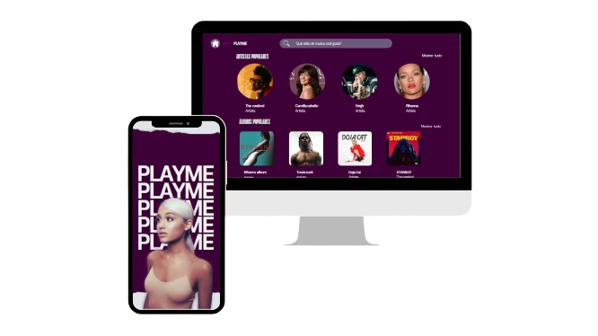

# 🎧 PLAYME – À Procura Da Batida Perfeita

Bem-vindo ao repositório do **PLAYME**, meu projeto conceitual de um aplicativo e site de música, onde **suas emoções definem a trilha sonora da sua vida**.

Este projeto foi criado com foco na experiência do usuário, permitindo que qualquer pessoa possa me conhecer com base na minha playlist
e músicas que eu gosto de ouvir.

---

## Objetivo

Criar wireframes para mobile e web com foco em:

- Design emocional e personalizado  
- Acessibilidade e clareza na navegação  
- Experiência fluida tanto no celular quanto no navegador  

---

## Wireframes:

### 📱 Versão Mobile

> Telas otimizadas para dispositivos móveis, com foco em usabilidade, acessibilidade e design limpo.

**Telas criadas:**

- Tela inicial;
- Tela de recomendações de albums e artistas;
- Tela de categorias;
- Tela de playlist.

📸 **Wireframes Mobile:**  
[🔗 Link para visualizar as telas mobile no Figma ou Imagens](https://www.canva.com/design/DAGu8iytd3o/FjxTs9cXkWaGuhIbz1f8Ag/edit?utm_content=DAGu8iytd3o&utm_campaign=designshare&utm_medium=link2&utm_source=sharebutton)

---

### 💻 Versão Web

> Layout responsivo e imersivo para o uso em navegadores desktop.

**Telas criadas:**

- Página inicial;
- Página de recomendações de albums e artistas;
- Página de categorias;
- Página de playlist. 

📸 **Wireframes Web:**  
[🔗 Link para visualizar as telas web no Figma ou Imagens](https://www.canva.com/design/DAGuqi3VtRw/9tbOmgQS7qtN4A0maRGV2w/edit?utm_content=DAGuqi3VtRw&utm_campaign=designshare&utm_medium=link2&utm_source=sharebutton)

## ✨ Visual do Projeto:

   
   Fonte: Mariana Ocireu.

##

  <h4>Contato</h4>
  

   Obrigada por visitar o meu repositório, caso queira se conectar comigo, estou disponíveil através do e-mail e LinkedIn!

  **Mariana Ocireu:**

